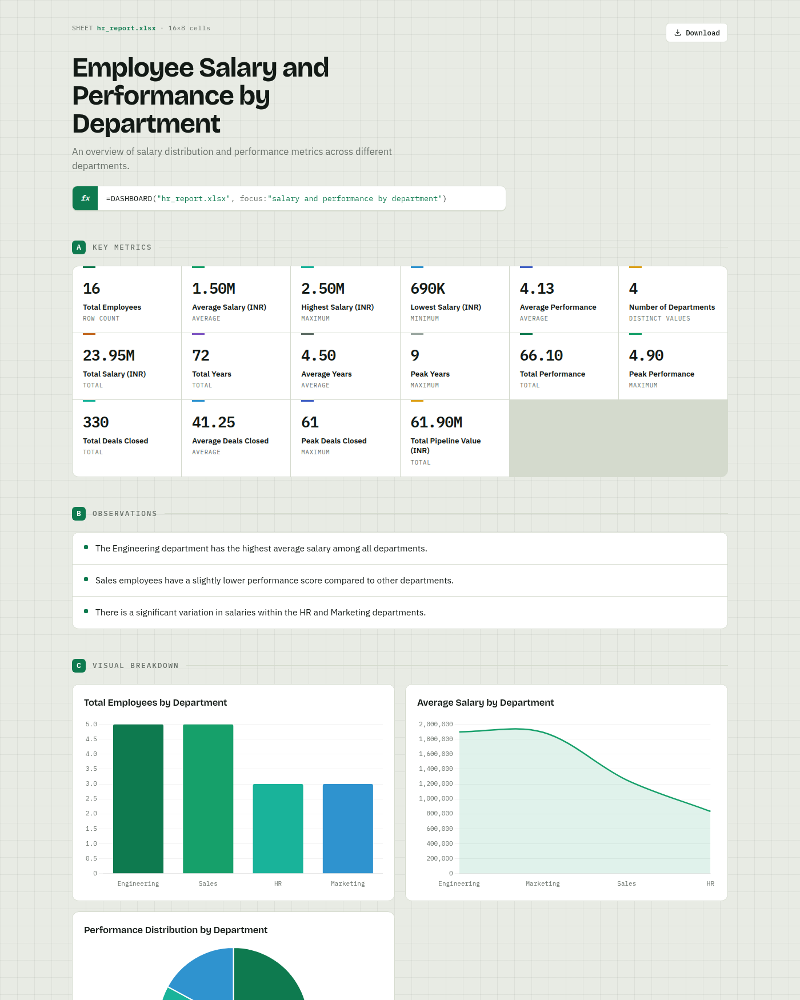
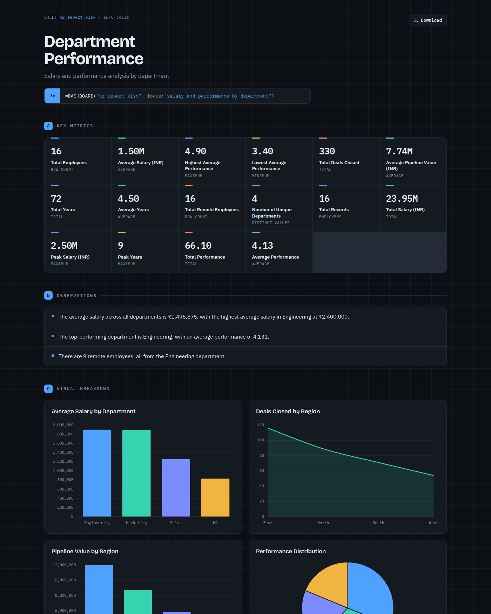

# Sheet → Dashboard

Drop an Excel-exported `.html` (or `.xlsx` / `.xls` / `.csv`) onto a local page and get back a
polished, interactive dashboard — KPIs, charts, full statistics, written insights and a searchable
data table. A **local LLM** reads your data and *designs* the dashboard, so it works on a
**different / unique sheet every time**: nothing is hardcoded to one report, and nothing ever
leaves your machine.



> The same data in the **Carbon** theme (one of four — Grid · Carbon · Indigo · Ember):
>
> 

```
file ─▶ pandas extracts the real tables    (deterministic — numbers are never hallucinated)
     ─▶ build a compact PROFILE of every column (type, stats, top values, samples)
     ─▶ a LOCAL Ollama model reads the profile and DESIGNS the dashboard
           → title, KPIs, which charts/groupings matter, written insights
     ─▶ the server computes the real chart/stat numbers from that plan
     ─▶ renders one self-contained, offline HTML dashboard
```

The split is deliberate: **the model supplies the intelligence** (what the data *means* and how to
show it), while **extraction and every number stay deterministic** so the dashboard is always
correct. If the model is unreachable or returns junk, the spec is validated against the real
columns and falls back to a deterministic plan, so it never fails to render.

## Features

- **Reads anything tabular** — Excel-as-HTML (even when headers are `<td>` cells), `.xlsx`/`.xls`
  (multi-sheet), and `.csv`. Cleans formatted numbers like `$48,000`, `32%`, `(1,200)`.
- **Lots of metrics** — 9 KPIs (Standard) or ~16 (Detailed), plus a full statistics section
  (numeric: mean / median / min / max / std / sum; categorical: distinct / most-common / count / share).
- **Charts** that fit the data — bar / line / pie / doughnut, chosen by the model.
- **Customisable** — set a focus prompt ("revenue by region"), detail level, chart density, and a theme.
- **Spreadsheet-native design** — a cell-grid backdrop, a `fx =DASHBOARD(...)` formula-bar hero,
  column-letter section markers, and monospace tabular numerals. Four themes: **Grid** (default),
  **Carbon**, **Indigo**, **Ember**.
- **Download** — every dashboard exports as a standalone offline HTML file.
- **100% local** — extraction is local; the LLM is your own Ollama instance.

## Requirements

- **Python 3.9+** and the packages in `requirements.txt`.
- **[Ollama](https://ollama.com)** running locally with at least one model pulled. The default is
  `llama3.2:3b` (fast, ~30 s/dashboard); it auto-falls-back to `qwen2.5:14b` →
  `qwen2.5-coder:14b` → `qwen2.5:1.5b`, then to a deterministic plan. Change `MODEL` in
  `analyzer.py` to trade speed for the sharper labels of a bigger model.

```bash
ollama pull llama3.2:3b      # or any model you prefer
```

## Setup & run

```bash
git clone https://github.com/nikhilcherry/sheet-dashboard.git
cd sheet-dashboard
pip install -r requirements.txt
./run.sh                     # or: python3 server.py
```

Open <http://localhost:8077>, drop a file, pick your options, and the dashboard opens in a new tab.
Generated dashboards are also saved under `generated/` and served at `/g/<name>.html`.

## How customisation maps through

| Upload control | Effect |
|----------------|--------|
| **Focus** (text) | Steers the model's KPIs / charts / insights toward a topic |
| **Detail level** | Standard (~9 KPIs) vs Detailed (~16 KPIs + full stats) |
| **Chart density** | Auto vs More charts |
| **Theme** | Grid · Carbon · Indigo · Ember |

## Project structure

| file | role |
|------|------|
| `server.py`   | Flask app — upload page, `POST /generate`, `GET /g/<name>` static serve |
| `analyzer.py` | extraction, profiling, the local-model call, KPI/chart/stat computation, fallback |
| `render.py`   | the themeable, self-contained HTML dashboard renderer |
| `run.sh`      | convenience launcher |

## Notes

- Extraction and all displayed **numbers are deterministic and correct**. With the fast `llama3.2:3b`
  model the free-text **labels/insights can be loosely worded**; switch `MODEL` to `qwen2.5:14b`
  for tighter wording at ~2.5× the time.
- KPI values count up on load — that's an animation; the final values are the real ones.

## License

[MIT](LICENSE) © nikhilcherry
